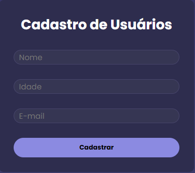

Cadastro de Usuários

💻 Sobre o projeto

Este projeto é um sistema simples de cadastro de usuários desenvolvido em React, utilizando hooks personalizados para gerenciamento de estado.

O aplicativo permite:

Cadastrar novos usuários (nome, idade e e-mail)

Listar todos os usuários cadastrados

Deletar usuários individualmente

O estado é centralizado no hook useUsers, garantindo separação de responsabilidades e mantendo os componentes filhos (UserForm e UserList) limpos e reutilizáveis.

🛠 Funcionalidades

CRUD de usuários: Create, Read e Delete

Validação de formulário: alerta se algum campo não for preenchido

Gerenciamento de estado com hooks personalizados

Interface simples e responsiva

Ícones SVG para ações (ex: botão de deletar)

📂 Estrutura do projeto
src/
├─ assets/
│  └─ trash.svg
├─ components/
│  ├─ UserForm/
│  │  └─ UserForm.jsx
│  └─ UserList/
│     └─ UserList.jsx
├─ hooks/
│  └─ useUsers.js
├─ pages/
│  └─ HomePage/
│     └─ index.jsx
├─ services/
│  └─ userService.js
└─ style.css

⚙ Tecnologias utilizadas

React – Biblioteca principal para construção de interfaces

Hooks do React – useState, useEffect e hook personalizado useUsers

JavaScript (ES6+) – Lógica e manipulação de dados

CSS – Estilização da aplicação

SVG – Ícones utilizados na interface

🚀 Como executar o projeto

Clone o repositório:

git clone https://github.com/paulojrtoledo/cadastro-de-usuarios-react.git

Instale as dependências:

npm install

Execute o projeto:

npm start

Abra no navegador:
http://localhost:3000

📝 Licença

Este projeto está licenciado sob a licença MIT.
